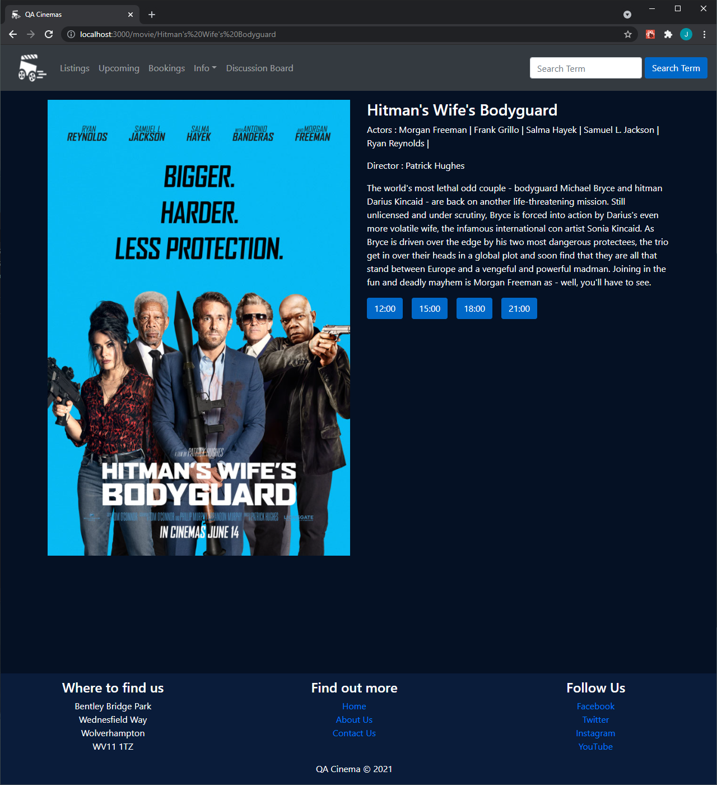
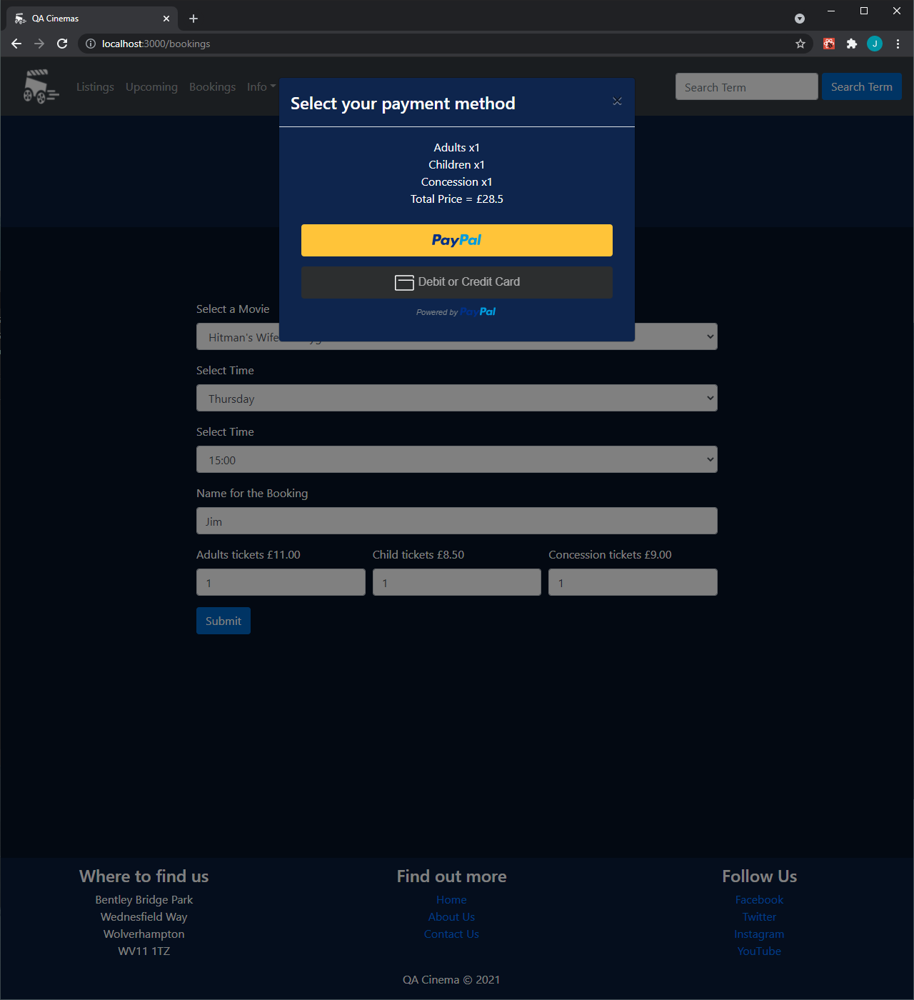
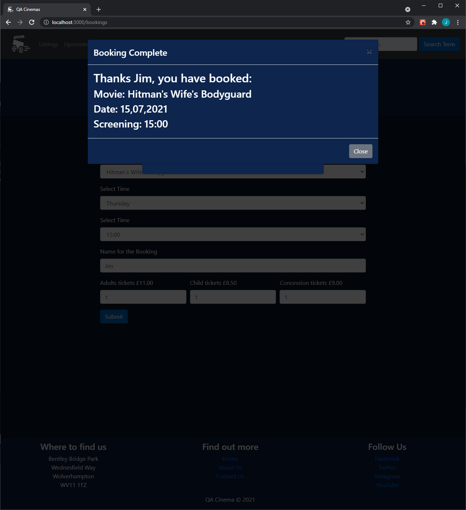

# Cinema Project

This project is a website for QA Cinemas that stores and presents data for the cinema. This includes current movie listings and upcoming movies, as well as local venues and information about the cinemas' location and opening times. The site has also features a discussion board where users can leave comments and rate movies they've seen.

The project was written in JavaScript, consisting of a frontend created with React and a backend created with Express. The database is hosted in the cloud using MongoDB Atlas.

## Getting Started

These instructions will get you a copy of the project up and running on your local machine for development and testing purposes. See deployment for notes on how to deploy the project on a live system.

### Prerequisites

1. [Node](https://nodejs.org/en/download/) to use npm.
2. [Git](https://git-scm.com/downloads) version control to download the repository.

### Installing

1. Use Git Bash or Command Prompt in the folder where you want to install the project.
2. Clone down the repo with this command:
```
git clone https://github.com/group-1-organization/cinema-project.git
```
3. Install the dependencies for the project:
    * `cd` into the `cinema-frontend` folder
    * run `npm i` to download packages for the frontend
    * `cd` into the `cinema-backend` folder
    * run `npm i` to download packages for the backend


### Usage

To use the full functionality of the site both parts of the application must be running.

1. `cd` into the `cinema-backend` folder and run `node index.js` to start the backend and connect to the database.
2. `cd` into the `cinema-frontend` folder and run `npm start` to start the frontend.

The site can now be accessed on [http://localhost:3000](http://localhost:3000)

From the homepage you can go to any part of the site using the navigation bar or the links in the footer. To book tickets to a movie first go to the listings page:


Then click on a movie to see the available showing times:



Clicking on a showing will take you to the booking page with the movie and time already selected (they can be selected here as well) where number of tickets and booking name can be entered. After clicking submit a prompt for payment will appear:



After going through the payment process confirmation will be displayed:



## Running the tests

The project contains seperate tests for the frontend and backend parts of the site. The backend tests can be run from the `cinema-backend` folder with the command `npm test`. The frontend tests can be run with same command from the `cinema-frontend` folder.

### Frontend Testing 

The Jest testing used for the frontend involves creating and testing against snapshots of the pages, to check that what was rendered was correct. There is also testing for any logic that is not part of the application backend.
```
example test
```

### Backend Testing 

Testing for the Express backend of the application was done using the Mocha testing framework with the Chai plugin for making HTTP requests. These tests focused on checking that requests to specified paths behaved as expected and that the database was interacted with successfully. They are all similar to the example below, which requests the movie with the specified name and checks that the response is a movie that has the correct title:
```
it(`should find a movie by name`, (done) => {
        chai.request(app).get('/cinema/movies/name/A Quiet Place Part II').end((error, response) => {
            if (error) {
                console.log(`Something went wrong`);
                done(error);
            }
            expect(response).to.have.status(200);
            expect(response).to.not.be.null;
            const body = response.body;
            body.map((movie) => {
                expect(movie).to.be.a("object");
                expect(movie).to.contain.keys("title");
                expect(movie.title).to.be.a("string");
                expect(movie.title).to.equal("A Quiet Place Part II")
            })
            done();
        })
    })
```


## Deployment

To ready the app for deployment the frontend must be built using the `npm run build` command.

This command builds the app for production to the build folder.
It correctly bundles React in production mode and optimizes the build for the best performance.
The build is minified and the filenames include the hashes.
See the React documentation about [deployment](https://facebook.github.io/create-react-app/docs/deployment) for more information.

## Project Board

[Project Board](https://ims-scotts.atlassian.net/jira/software/projects/QC/boards/7/backlog)

## Versioning

We use [SemVer](http://semver.org/) for versioning.

## Authors

* **Amandeep Bassi** - [AmanBassi](https://github.com/AmanBassi)
* **James Barnett** - [JamesBarnett44](https://github.com/JamesBarnett44)
* **Richard Redman** - [sgtnamder](https://github.com/sgtnamder)
* **Scott Stevens** - [Diakoptes24](https://github.com/Diakoptes24)

## Acknowledgments

* The QA trainers
